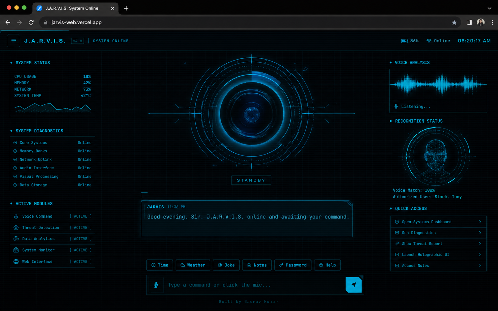

<div align="center">

# J.A.R.V.I.S.

### *Just A Rather Very Intelligent System.*

[](https://jarvis-web-alpha.vercel.app)
[](https://developer.mozilla.org/en-US/docs/Web/HTML)
[](https://developer.mozilla.org/en-US/docs/Web/JavaScript)
[](https://github.com/TheAlgo7/jarvis-web)

</div>



JARVIS is a browser assistant that puts personality and interface design on equal footing with functionality. It runs primarily in the frontend, listens through the Web Speech API, responds through text and voice, and wraps the whole interaction model in an amber-on-black HUD that feels closer to a command deck than a chatbot page. The point is not just to ask questions — it is to feel like you are operating a system. Originally born as a college project by **Gaurav Kumar** and **Ameen James**, then rebuilt into the version it should have been: faster, sharper, more theatrical, and far more intentional.

## What It Can Do

- **Voice-first interaction** with fallback text input.
- **Utility commands** for search, notes, quick actions, and browser workflows.
- **Weather and lightweight live data** integration.
- **Persistent local notes** without needing a user account.
- **A distinct personality layer** instead of sterile assistant output.

## How It Works

JARVIS splits into two layers:

**Frontend shell** (`index.html`, `style.css`, `app.js`) — Runs entirely in the browser. Handles voice input via the Web Speech API, renders the HUD interface, manages localStorage notes, and routes commands locally where possible.

**Serverless endpoint** (`api/ask.js`) — A single Vercel serverless function that proxies requests to the AI backend. Keeps API keys out of the client. The frontend calls it only when a command needs external intelligence — search, weather, or open-ended questions.

This split means the HUD loads instantly, local commands work offline, and the AI layer scales independently.

## Stack

| Layer | Technology |
| --- | --- |
| UI | HTML, CSS, Vanilla JavaScript |
| Voice | Web Speech API |
| Persistence | localStorage |
| Serverless | `api/ask.js` (Vercel) |
| Hosting | Vercel |

## Design Language

- **Iron HUD.** Amber glows, scan-line energy, tactical framing, and high-contrast surfaces.
- **No framework bloat.** The interface stays immediate and lightweight.
- **Personality matters.** This project leans into presence, not generic assistant minimalism.
- **Nostalgia, upgraded.** The original student-project DNA is still there, just treated seriously.

<details>
<summary>Quick Start</summary>

For the frontend shell:

```bash
git clone https://github.com/TheAlgo7/jarvis-web.git
cd jarvis-web
python -m http.server 8000
```

Open `http://localhost:8000`.

For full hosted behaviour including the AI endpoint, deploy to Vercel — the `api/ask.js` serverless function is picked up automatically.

</details>

<div align="center">

Built for the version of browser AI that should have looked **cool from the first second** — by **[The Algothrim](https://thealgothrim.com)**

</div>
