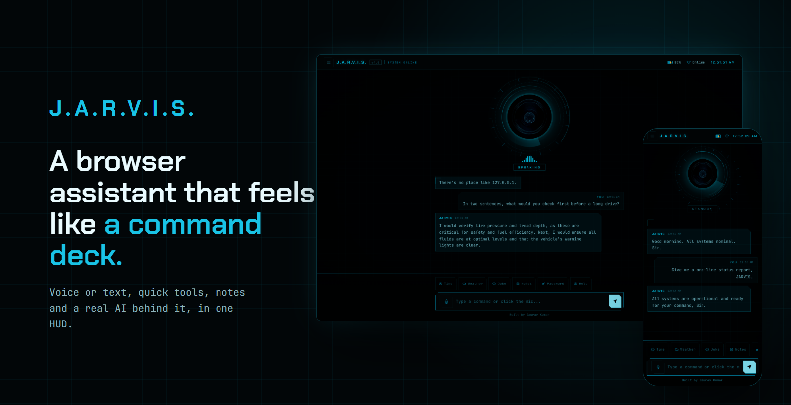
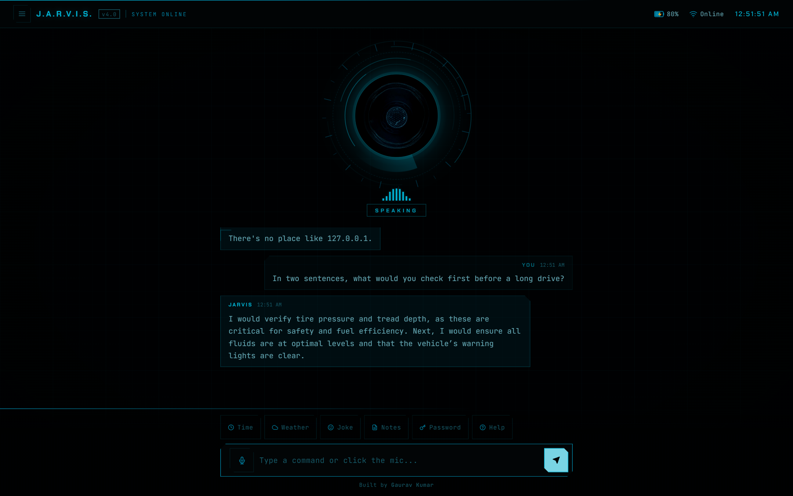
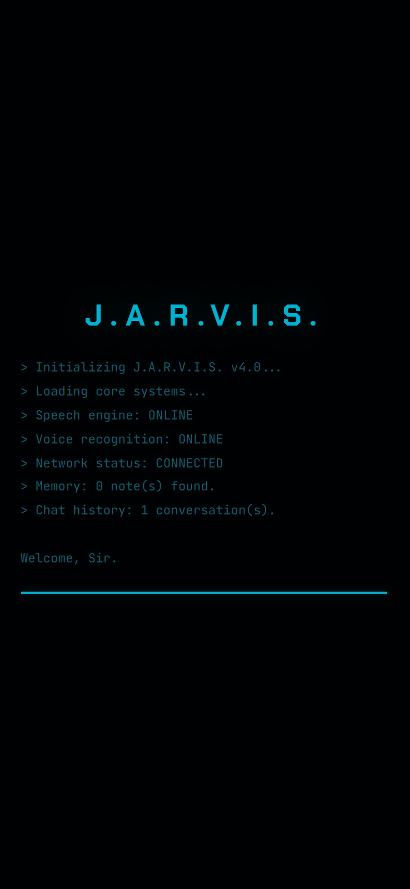
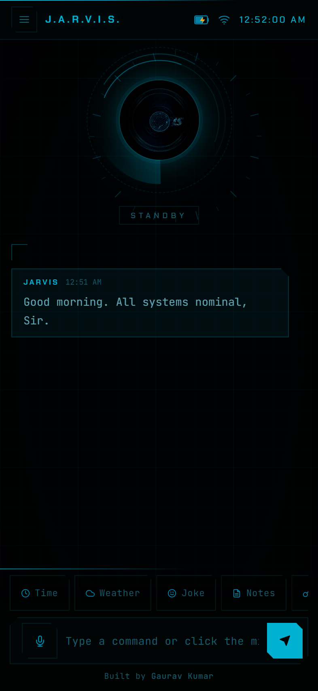
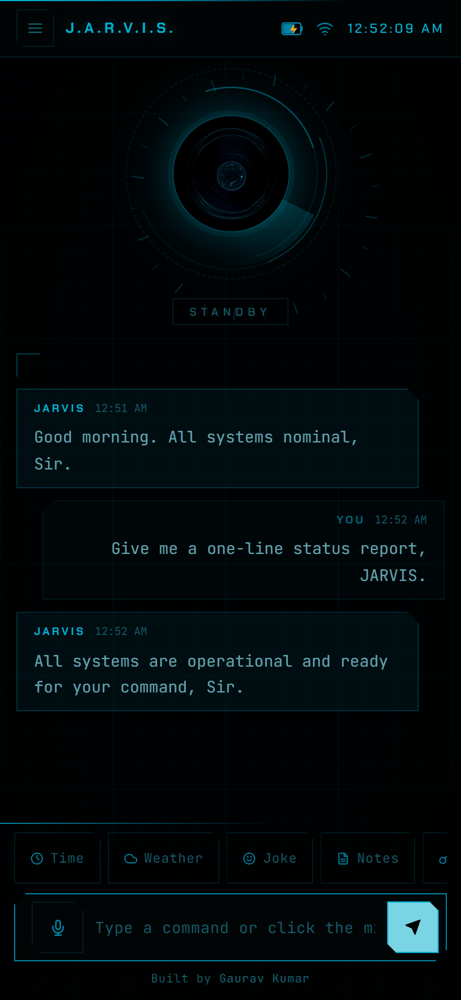
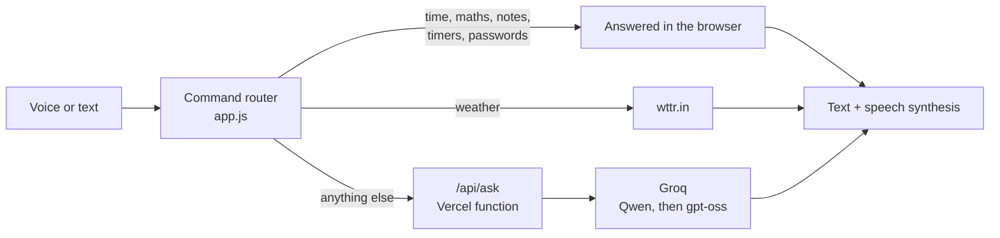

<p align="center">
  
</p>

<p align="center">
  <strong>Just A Rather Very Intelligent System: a voice and text assistant in a cyan HUD, in any browser.</strong><br>
  Quick tools run on the device; open questions go to a real AI with a calm, dry British voice.
</p>

<p align="center">
  <a href="https://jarvis-web-alpha.vercel.app"><strong>Open JARVIS</strong></a>
  &nbsp;·&nbsp;
  <a href="#what-it-can-do">What it can do</a>
  &nbsp;·&nbsp;
  <a href="#how-it-works">How it works</a>
  &nbsp;·&nbsp;
  <a href="#run-it-locally">Run it locally</a>
</p>

<p align="center">
  
  
  
</p>

## Why JARVIS

This started as a college project by Gaurav Kumar and Ameen James, and was rebuilt years later into the version it should have been. The point was never another chat page. It is an assistant with presence: a boot sequence, a reactor core that listens and speaks, and a personality modelled on the one from the films.

Most of what it does happens in the browser, instantly and without an account. Only questions that need real intelligence leave the page.

## Screenshots

<p align="center">
  
</p>

<table>
  <tr>
    <td align="center"><br><sub>The boot sequence</sub></td>
    <td align="center"><br><sub>Standby</sub></td>
    <td align="center"><br><sub>An answer from the AI</sub></td>
  </tr>
</table>

## What it can do

- **Talk or type.** Tap the mic and speak, or type; JARVIS answers in text and out loud.
- **Quick tools, on the device.** Time and date, weather for any city, jokes, calculations, timers, strong passwords, and battery and connection status.
- **Open things.** "Open github.com", "search for...", "play..." on YouTube, or a Wikipedia summary.
- **Notes.** "Remember..." saves a note in the browser; ask for your notes to read them back.
- **Real answers.** Anything else goes to the AI with the last 20 messages for context.
- **Chat history.** A sidebar of past conversations with search, rename and delete.
- **Your title.** "Call me Boss" and JARVIS stops saying Sir.

## How it works


```mermaid
flowchart LR
  you["Voice or text"] --> router["Command router<br/>app.js"]
  router -- "time, maths, notes,<br/>timers, passwords" --> local["Answered in the browser"]
  router -- "weather" --> wttr["wttr.in"]
  router -- "anything else" --> ask["/api/ask<br/>Vercel function"]
  ask --> groq["Groq<br/>Qwen, then gpt-oss"]
  local --> speak["Text + speech synthesis"]
  wttr --> speak
  groq --> speak
```

- **A router before a model.** `app.js` matches commands with plain patterns first, so the common things are instant and work without the AI.
- **The key never reaches the browser.** `/api/ask` is a small Vercel function that holds the Groq key, caps each request to the app's own 20-message history, and falls back to a second model if the first is unavailable.
- **Local by default.** Notes, conversations and your title live in `localStorage`. There is no account.

## Built with

| Layer | Choice |
|---|---|
| Interface | HTML, CSS and vanilla JavaScript, Chakra Petch and JetBrains Mono |
| Voice | Web Speech API for recognition and speech synthesis |
| AI | Groq through one Vercel function |
| Weather | wttr.in |
| Hosting | Vercel |

## Run it locally

The interface, voice, tools and notes run from any static server:

```bash
git clone https://github.com/TheAlgo7/jarvis-web.git
cd jarvis-web
python -m http.server 8000
```

Open http://localhost:8000. For AI answers, deploy to Vercel and set `GROQ_API_KEY` (a free key from [console.groq.com](https://console.groq.com)); `api/ask.js` is picked up automatically.

`python scripts/readme-shots.py` rebuilds the screenshots in this README from the live site.

## Licence

Copyright © 2026 Gaurav Kumar, [The Algothrim](https://thealgothrim.com). All rights reserved.

The code is public to read and learn from. It is not licensed for reuse. J.A.R.V.I.S. is a fan project and is not affiliated with Marvel.
